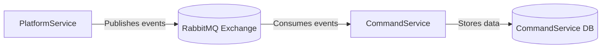

# .NET Microservices with RabbitMQ and Kubernetes

## 📌 Overview
This repository demonstrates a microservices architecture built with **.NET 8**, **RabbitMQ**, and **Kubernetes**.  
It contains two services:

- **PlatformService** → Publishes events when new platforms are created.
- **CommandService** → Subscribes to events and persists them in its own database.

The project showcases modern async programming, dependency injection, EF Core migrations, and event-driven communication between services.

---

## 🛠 Tech Stack
- **.NET 8 / C#**
- **RabbitMQ.Client v7.2.1**
- **Entity Framework Core**
- **Docker & Kubernetes (Docker Desktop)**
- **AutoMapper**
- **Swagger / OpenAPI**

---

## ⚙️ Architecture



## 🚀 Getting Started

### 1. Clone the repository
```bash
git clone https://github.com/yourusername/dotnet-microservices-rabbitmq.git
cd dotnet-microservices-rabbitmq
```
2. Build Docker image
```bash
docker build -t yourusername/platformservice ./PlatformService
docker build -t yourusername/commandservice ./CommandService
```
3. Apply Kubernetes manifests
```bash
kubectl apply -f k8s/platforms-depl.yaml
kubectl apply -f k8s/platforms-srv.yaml
kubectl apply -f k8s/commands-depl.yaml
kubectl apply -f k8s/commands-srv.yaml
```
4. Port-forward PlatformService
```bash
kubectl port-forward service/platformnpmservice-srv 8080:80
```

Now you can access the API at:http://localhost:8080/api/platforms
Example Usage
Create a new platform
```
curl -X POST http://localhost:8080/api/platforms \
  -H "Content-Type: application/json" \
  -d '{"name":"Test Platform","publisher":"Self","cost":"Free"}'
```
